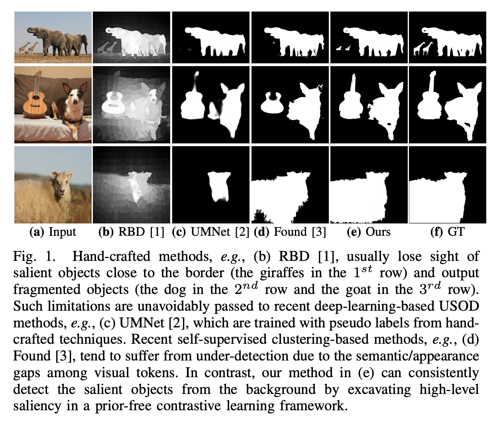
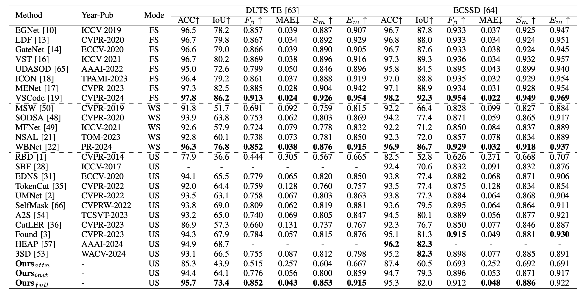

# A Contrastive-Learning Framework for Unsupervised Salient Object Detection

> This is the official repo for journal paper "A Contrastive-Learning Framework for Unsupervised Salient Object Detection" (TIP2025).

> Authors: Huankang Guan, Jiaying Lin, [Rynson W.H. Lau](https://www.cs.cityu.edu.hk/~rynson/)

> City University of Hong Kong



## Installation
We use `uv` to manage our environment.
```shell
uv venv
source .venv/bin/activate
uv pip install torch torchvision numpy pillow progressbar thop pandas opencv-python tqdm joblib albumentations tensorboard
uv pip install git+https://github.com/lucasb-eyer/pydensecrf.git
```
Or `uv pip install -r requirements.txt` and then `uv pip install git+https://github.com/lucasb-eyer/pydensecrf.git`.

## Dataset & Checkpoints & Our Results
We zip (`dataset`, `checkpoints` and `our results`) into [`assets.zip`](https://drive.google.com/file/d/1nksMGiUzk-Xk_BpW22b87gEeUquNngTL/view?usp=sharing). Download and unzip it to current directory. 

## Training
```shell
source .venv/bin/activate
python train.py --name training_csnet
```
The output is located in `assets/output/training_csnet`. 

## Inference
```shell
source .venv/bin/activate
python testmodel.py --weights assets/model_cards/csnet_init_13200.pth --name inference_csnet_init_13200
```
The output is located in `assets/output/inference_csnet_init_13200`. If you want results without CRF, run `python testmodel.py --weights assets/model_cards/csnet_init_13200.pth --name inference_csnet_init_13200 --crf_round int:0` (faster, No CRF).

## Model Complexity
```shell
python flops.py --name flops
```


## Our Results




## config.json
`crf`: The number of CRF iteration during training step. [only valid for training]  
`crf_round`: The number of CRF iteration for evaluation. default: 10. If it is set to 0, no CRF is applied. If less than 0, apply bilateral solver.  
`weights`: Full checkpoint.  
`backboneWeight`: backbone checkpoint. 

## Cite
```cite
@ARTICLE{10964591,
  author={Guan, Huankang and Lin, Jiaying and Lau, Rynson W. H.},
  journal={IEEE Transactions on Image Processing}, 
  title={A Contrastive-Learning Framework for Unsupervised Salient Object Detection}, 
  year={2025},
  volume={34},
  pages={2487-2498},
  doi={10.1109/TIP.2025.3558674},
  ISSN={1941-0042},
  month={4}
}
```